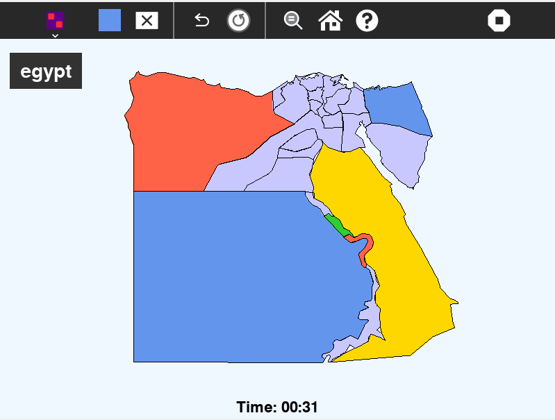

# Four Color Map Puzzle

The **Four Color Map Puzzle** is a fun and educational game based on the famous Four Color Theorem, which states that no more than four colors are needed to color any map so that no two adjacent regions share the same color. Your goal is to color all regions of a given map using just four colors, without having any neighboring regions with the same color.

  



## How to Play

1. **Starting the Game:**
   - Launch the Four Color Map Puzzle application.

2. **Objective:**
   - Color the entire map using only **four colors**.
   - Ensure that **no two adjacent regions** (those that share a border) have the same color.

3. **Controls:**
   - Click on a region to select it.
   - Choose a color from the available palette.
   - Use undo/reset buttons as needed to fix mistakes or start over.

4. **Winning the Game:**
   - The puzzle is complete when all regions are colored correctly with **no adjacent color conflicts**.

---

## How to Use

For a step-by-step walkthrough, see the official documentation on installing activities:

[How to Install Activities – Sugar Labs Wiki](https://wiki.sugarlabs.org/go/How_to_install_activities)

Alternatively, for development or testing purposes, you may clone or copy the activity directory into your `~/Activities` folder and then restart Sugar to have it appear in the activity ring:

```bash
git clone <repository-url> ~/Activities/<activity-name>

cp -r /path/to/local/activity ~/Activities/
```